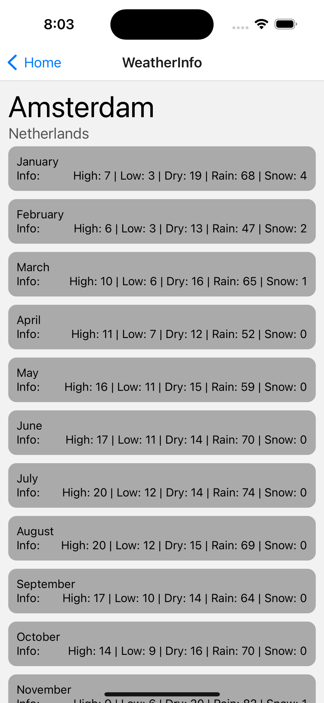

## React Native Code Challenge

### Purpose
The purpose of this task is to evaluate your:
- communication
- collaboration
- design thinking
- clean coding

The people joining the meeting are not there to evaluate you, but rather to help you succeed (as your team mates would). So please use them wisely to solve these tasks.

### Requirements you need on your laptop
- Xcode and Android Studio
- Ruby 2.7.5 (required by React Native 0.70+). Preferably installed using rvm
- Cocoapods
- Yarn v1
- Node 16

### Introduction
This project contains two simple packages: a mobile app and a backend. The mobile app depend on the backend, so make sure that the backend is launched **before** running the mobile app. The mobile app loads a few cities and countries from the backend and displays them in the app. Each item will contain some metadata about the average temperature and rainfalls/snowfalls during each month. The data is directly streamed from the backend API which loads the data from a simple json file. For task 1-4, use Xcode when building the app.

The backend app is written in typescript (node 16). The mobile app uses React Native (0.70) and is also written using typescript. The mobile app uses react navigation to navigate between different views. The whole project uses yarn workspaces as a way to organize packages within the same domain.

#### Task 1 - Detail View Navigation
The home screen in the mobile app will display all countries and cities. When the user presses the an item on the home screen, they should be redirected to the `WeatherInfoScreen` where the country and city is displayed.

Currently the `WeatherInfoScreen` shows the wrong information. Your task is to implement that data transfer from the `HomeScreen` to the `WeatherInfoScreen` components in the best way possible so that it shows the correct data.

---

#### Task 2 - Weather Rendering
In the `WeatherInfoScreen` there is currently a `renderMonthlyData()` that returns null. The `WeatherApiService` contains a `getById()` that will return the monthly statistics when passing the object id. Those should be rendered in the view for each month.

Your task is to fetch the information and render it in the view. An example of the expected output can be seen in the screenshot down below. Use the `renderMonthlyData` function when implementing your solution. Note: UI is not a part of this task so make it as simple as possible.

---

#### Task 3 - Tablet Support
Currently the app only supports phones. On tablets, there are definitely improvements. Launch the app on an iPad and make the app look better there. Try to use the screen space as much as possible!

---

#### Task 4 - Slow API
Go to `packages/backend/.env` and set `FAKE_LATENCY` to `5000`. Restart the backend and mobile app. When navigating between `WeatherInfoScreen` and `HomeScreen` there will be a significant delay compared to before. How can such experience be improved for the user? Implement a solution that will improve load times when moving between different scenes many times. Keep performance and stability in mind! Is there a way to keep the data loaded even after the scene is unmounted?

---

#### Task 5 - Adding android support
Currently the app is broken on android and cannot build successfully. It is something that can occur in a developer's daily work or after breaking changes in major packages.

Your task is to make the app work on android and be able to build it successfully on any android device.

---
# Weather-app
